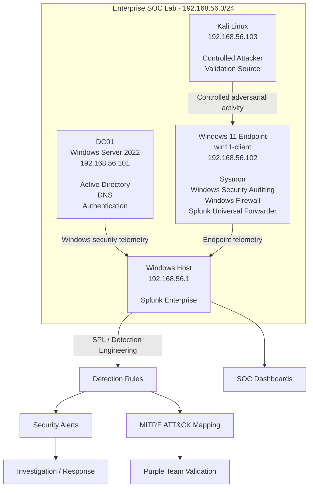
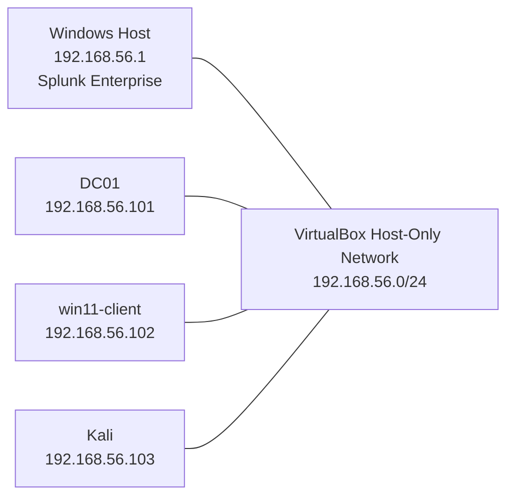
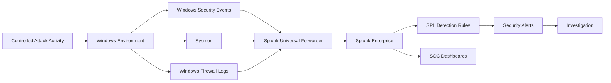
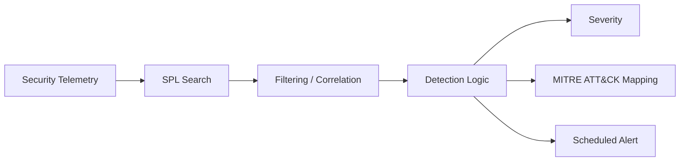
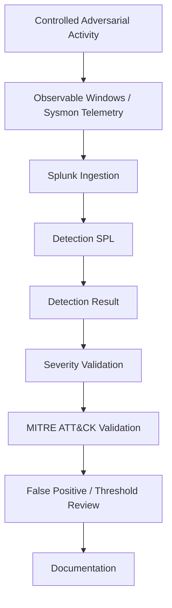
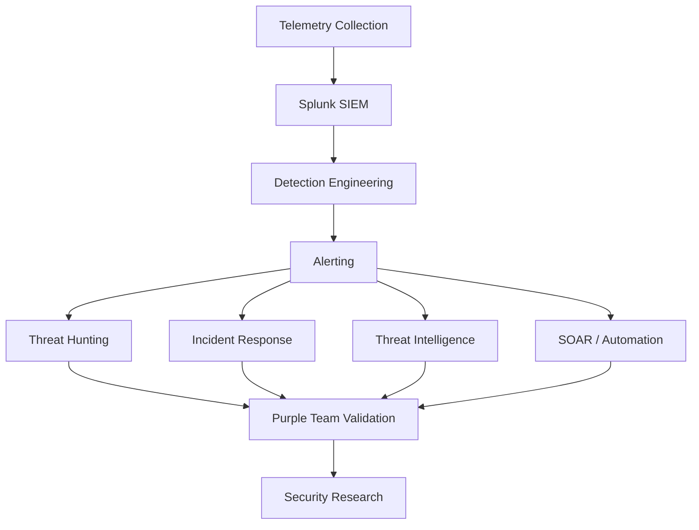

# Enterprise SOC Lab Architecture

## 1. Overview

The Enterprise SOC Lab is a controlled and isolated cybersecurity environment designed to simulate core enterprise Security Operations Center workflows.

The architecture connects:

- Enterprise-style Windows infrastructure
- Active Directory and centralized authentication
- A monitored Windows endpoint
- A controlled Kali Linux attack source
- Windows Security telemetry
- Sysmon endpoint telemetry
- Windows Firewall telemetry
- Splunk Universal Forwarder
- Splunk Enterprise
- SPL-based detection engineering
- Security alerting
- SOC investigation dashboards
- MITRE ATT&CK mapping
- Purple Team validation
- Threat hunting, incident response, threat intelligence, and SOAR workflows

The lab is intentionally isolated from production infrastructure and is used only for authorized security testing and validation.

---

# 2. High-Level Architecture



---

# 3. Network Architecture

The lab uses a VirtualBox Host-Only network for controlled communication between the laboratory systems.

```text
Network: 192.168.56.0/24
```

| System | Hostname | IP Address | Primary Role |
|---|---|---:|---|
| Windows Host | Host | `192.168.56.1` | Splunk Enterprise |
| Windows Server 2022 | `DC01` | `192.168.56.101` | Active Directory / DNS / Authentication |
| Windows 11 | `win11-client` | `192.168.56.102` | Monitored endpoint |
| Kali Linux | Kali | `192.168.56.103` | Controlled attacker / validation source |

### Domain

```text
Domain: soclab.local
```

### Network Design



---

# 4. Windows Server / Domain Controller

## DC01

**Operating System:** Windows Server 2022

**IP Address:**

```text
192.168.56.101
```

**Domain:**

```text
soclab.local
```

### Primary responsibilities

- Active Directory Domain Services
- DNS
- Centralized authentication
- Domain account management
- Kerberos authentication
- Windows security event generation

DC01 provides the identity and authentication layer required to simulate enterprise Windows security activity.

---

# 5. Windows 11 Monitored Endpoint

## win11-client

**Operating System:** Windows 11 Pro

**Host-Only IP:**

```text
192.168.56.102
```

The Windows 11 endpoint acts as the primary monitored workstation in the lab.

### Security telemetry configured on the endpoint

- Windows Security Event Logs
- Sysmon
- Windows Firewall logging
- Process creation auditing
- Network connection telemetry
- Windows Filtering Platform events
- Splunk Universal Forwarder

The endpoint is also used to generate controlled activity for detection validation.

---

# 6. Kali Linux Attack / Validation System

## Kali Linux

**Host-Only IP:**

```text
192.168.56.103
```

Kali Linux functions as the controlled adversarial system used to generate authorized security activity.

Examples of activities performed in the lab include:

- Network reconnaissance
- TCP connection testing
- Authentication testing
- Controlled adversarial activity
- Detection validation
- Purple Team exercises

All activity is performed against the isolated laboratory environment.

---

# 7. Splunk Architecture

Splunk Enterprise is installed on the physical Windows host.

```text
Windows Host
192.168.56.1
       │
       ▼
Splunk Enterprise
       │
       ├── Search & Reporting
       ├── SPL Detection Rules
       ├── Scheduled Alerts
       ├── Dashboard Studio
       ├── Investigation
       └── Detection Validation
```

The Splunk instance acts as the central SIEM platform for the laboratory.

---

# 8. Telemetry Pipeline

The telemetry pipeline follows the following general flow:



---

# 9. Telemetry Sources

## 9.1 Windows Security Events

The lab uses Windows Security auditing to provide authentication, process, network, and security-related telemetry.

Important event IDs used in the detection portfolio include:

| Event ID | Security Context |
|---:|---|
| `4624` | Successful logon |
| `4698` | Scheduled task creation |
| `4740` | Account lockout |
| `4771` | Kerberos authentication failure |
| `5156` | Windows Filtering Platform connection |
| `7045` | Windows service creation |

These events provide the foundation for multiple authentication, persistence, and administrative activity detections.

---

# 10. Sysmon Telemetry

Sysmon provides enhanced endpoint visibility beyond standard Windows Security auditing.

Important telemetry used by the lab includes:

| Sysmon Event | Purpose |
|---:|---|
| `1` | Process creation |
| `3` | Network connection |

Additional process context includes:

- Command-line information
- Parent process information
- Process GUID
- User context
- Image information
- Destination IP
- Destination port
- Network protocol

This telemetry supports detections involving PowerShell, process behavior, network activity, discovery, and suspicious outbound connections.

---

# 11. Windows Firewall Telemetry

Windows Firewall logging is used to provide network-level visibility.

The firewall telemetry provides information such as:

- Action
- Protocol
- Source IP
- Destination IP
- Source port
- Destination port
- Allowed connections
- Dropped connections

The firewall telemetry is particularly useful for controlled network reconnaissance and connection-analysis experiments.

---

# 12. Splunk Universal Forwarder

The Splunk Universal Forwarder is used to forward endpoint telemetry into Splunk Enterprise.

The Windows 11 endpoint forwards security-relevant telemetry toward:

```text
Splunk Enterprise
192.168.56.1:9997
```

The forwarding pipeline allows the lab to simulate an enterprise endpoint-to-SIEM telemetry architecture.

---

# 13. Detection Engineering Layer

Once telemetry reaches Splunk Enterprise, SPL searches are used to identify suspicious activity.



The current detection portfolio contains 15 detection IDs.

`DET-002` is retained as a disabled legacy/duplicate detection and has been superseded by `DET-010`.

---

# 14. Detection Validation Architecture

Detection development is followed by controlled validation.



The validation process is designed to answer:

> Did the expected adversarial behavior produce the expected telemetry and did the detection identify it correctly?

---

# 15. MITRE ATT&CK Integration

Applicable detections are mapped to MITRE ATT&CK techniques when the available telemetry provides sufficient evidence.

Current examples include:

| Detection Area | ATT&CK Technique |
|---|---|
| Password Guessing | `T1110.001` |
| Password Spraying | `T1110.003` |
| PowerShell | `T1059.001` |
| Ingress Tool Transfer | `T1105` |
| Account / Group Discovery | `T1087` / `T1069` sub-techniques |
| Windows Service | `T1543.003` |
| Scheduled Task | `T1053.005` |

Some detections are intentionally classified as operational monitoring when the available telemetry does not support a specific ATT&CK technique.

This prevents unsupported ATT&CK mappings from being introduced simply to increase apparent coverage.

---

# 16. SOC Dashboard Layer

Splunk Dashboard Studio is used to provide different operational views.

The current dashboard ecosystem includes:

- Executive SOC Dashboard
- SOC Overview — Enterprise Security Operations Center
- Detection Engineering Dashboard
- Incident Response & Threat Hunting
- Threat Intelligence & IOC Dashboard
- SOAR & Incident Automation
- MITRE ATT&CK Detection Coverage
- Purple Team & MITRE ATT&CK Validation Dashboard

The dashboards serve different audiences and workflows rather than functioning as duplicate views of the same data.

---

# 17. SOC Operations Architecture

The broader SOC workflow is organized into several capability layers.



---

# 18. Security Isolation

The laboratory is designed as a controlled security testing environment.

The lab uses:

- VirtualBox virtualization
- Host-only networking
- Dedicated laboratory IP addresses
- Controlled attacker activity
- Authorized test targets

The environment is not intended to interact with external systems during adversarial testing.

---

# 19. Security Considerations

The following information must not be committed to the public repository:

- Passwords
- API keys
- Authentication tokens
- Private keys
- `.env` files containing secrets
- Splunk credentials
- Database credentials
- VM disk images
- VirtualBox snapshots
- License keys
- Sensitive personal information

The repository should contain sanitized configuration examples and documentation rather than live secrets or complete virtual machine images.

---

# 20. Architecture Status

| Architecture Component | Status |
|---|---|
| VirtualBox Lab | ✅ Complete |
| Host-Only Network | ✅ Operational |
| Windows Server 2022 / DC01 | ✅ Complete |
| Active Directory | ✅ Complete |
| DNS | ✅ Complete |
| Windows 11 Endpoint | ✅ Complete |
| Kali Linux Attacker | ✅ Complete |
| Sysmon | ✅ Operational |
| Windows Security Auditing | ✅ Operational |
| Windows Firewall Telemetry | ✅ Operational |
| Splunk Enterprise | 🟢 Operational |
| Splunk Universal Forwarder | 🟢 Operational |
| Detection Engineering | 🟢 Built |
| Alert Engineering | ✅ Complete |
| MITRE ATT&CK Mapping | 🟢 Built |
| SOC Dashboards | 🟢 Built |
| Purple Team Validation | 🟢 Substantially Complete |
| Enterprise SPL Audit | 🟡 In Progress |
| Advanced SOAR | ⏳ Remaining |
| Research Experiments | ⏳ Planned |

---

# 21. Design Philosophy

The architecture follows a simple principle:

```text
Generate
   ↓
Observe
   ↓
Ingest
   ↓
Detect
   ↓
Alert
   ↓
Investigate
   ↓
Validate
   ↓
Respond
   ↓
Measure
   ↓
Improve
```

The purpose of the lab is therefore not only to demonstrate that a detection can fire.

It is to demonstrate the complete security engineering process:

> **Understand the behavior → collect the evidence → build the detection → validate it → investigate it → measure it → improve it.**
